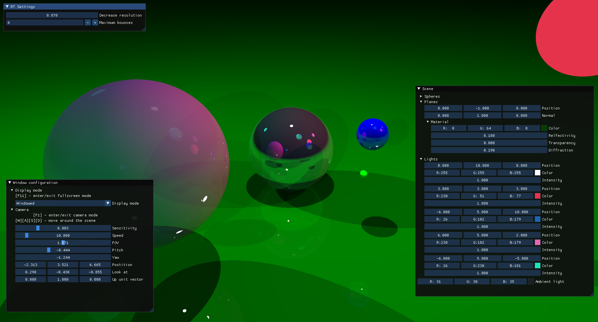

# Simple raytracer
- ray tracing calculations done on CPU
- uploaded as OpenGL texture
- rendered on a quad

## Screenshot

You can move spheres and change their material. Camera is also fully controllable.

# Dependencies
To compile you need `cmake`.
- `OpenMP`
- `glad`
- `glm`
- `glfw`
- `imgui`

To get libraries `vcpkg` is recommended.